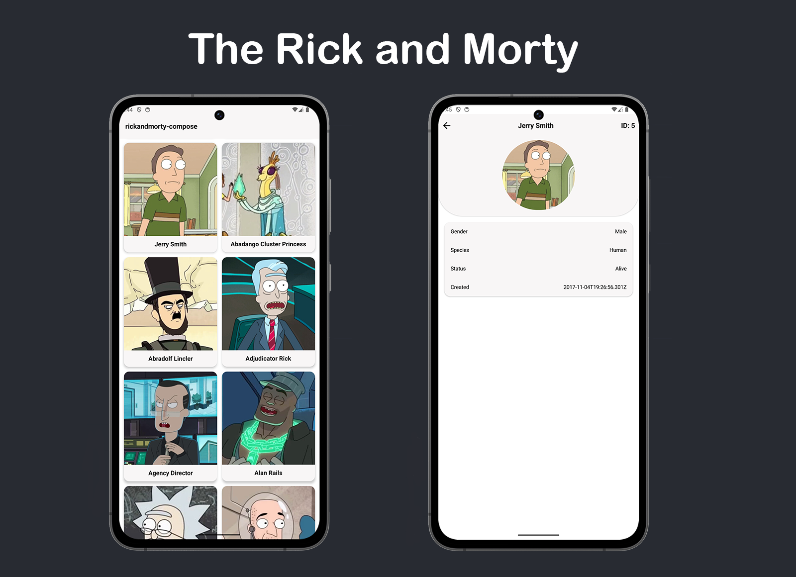

<h1 align="center">Rick And Morty Compose</h1>

<p align="center">  
The Rick And Morty Compose demonstrates modern multi-module Android development with Jetpack Compose, Jetpack libraries, Hilt, Coroutines, Flow and Material Design based on MVVM architecture.
</p>

<p align="center">

</p>

## Tech stack & Open-source libraries

- Minimum SDK level 24.
- [Kotlin](https://kotlinlang.org/) based, utilizing [Coroutines](https://github.com/Kotlin/kotlinx.coroutines) + [Flow](https://kotlin.github.io/kotlinx.coroutines/kotlinx-coroutines-core/kotlinx.coroutines.flow/) for asynchronous operations.
- [Hilt](https://dagger.dev/hilt/): For dependency injection.
- Jetpack Libraries:
  - Jetpack Compose
  - Navigation
  - Room
  - Lifecycle
  - ViewModel
- Architecture:
  - MVVM Architecture
  - Repository Pattern
- [Retrofit2 & OkHttp3](https://github.com/square/retrofit): For REST APIs and network data retrieval.
- [Kotlin Serialization](https://github.com/Kotlin/kotlinx.serialization): For serialization.
- [ksp](https://github.com/google/ksp): Kotlin Symbol Processing API for code generation and analysis.
- [Glide](https://bumptech.github.io/glide/int/compose.html): Image loading library that fetches and displays network images.

## Architecture
**The Rick And Morty Compose** app follows the MVVM (Model-View-ViewModel) architecture, incorporating the Repository pattern to manage data operations and ensure a clean separation of concerns, as detailed in [Google's official architecture guidance](https://developer.android.com/topic/architecture).

## Architecture Overview
The architecture of The Rick and Morty Compose is structured into two distinct layers: the UI layer and the data layer.Each layer has its own responsibilities.

### UI Layer
The UI layer includes the screen elements that users interact with and the ViewModel, which handles app data and keeps it safe during screen rotations or other changes. The UI elements listen to data updates to stay in sync with the underlying data layer.

### Data Layer
The data layer contains application data and business logic. The business logic is what gives value to your app—it's made of real-world business rules that determine how application data must be created, stored, and changed.

## Modularization

**The Rick and Morty Compose** app uses modularization with these benefits:

- **Reusability**: Dividing reusable code into separate modules makes it easier to share and limits access to other parts of the app.
- **Faster Builds**: Modules can be built at the same time, reducing overall build time.
- **Better Access Control**: Modules expose only specific components, preventing unintended use by other parts of the app.
- **Focused Development**: Teams can work on their assigned modules independently without overlapping.

For more details, check out the [Guide to Android app modularization](https://developer.android.com/topic/modularization)..

## Implemented Open API

The Rick and Morty API is a REST(ish) and GraphQL API based on the television show Rick and Morty. You will have access to about hundreds of characters, images, locations and episodes. The Rick and Morty API is filled with canonical information as seen on the TV show.Please note that currently only the characters part is implemented.

# License
```xml
Designed and developed by Wisal Muhammad

Licensed under the Apache License, Version 2.0 (the "License");
you may not use this file except in compliance with the License.
You may obtain a copy of the License at

   http://www.apache.org/licenses/LICENSE-2.0

Unless required by applicable law or agreed to in writing, software
distributed under the License is distributed on an "AS IS" BASIS,
WITHOUT WARRANTIES OR CONDITIONS OF ANY KIND, either express or implied.
See the License for the specific language governing permissions and
limitations under the License.
```